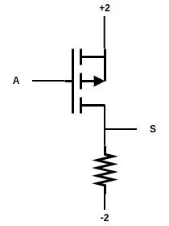
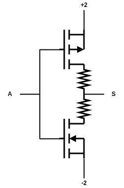
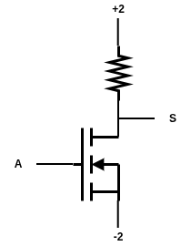
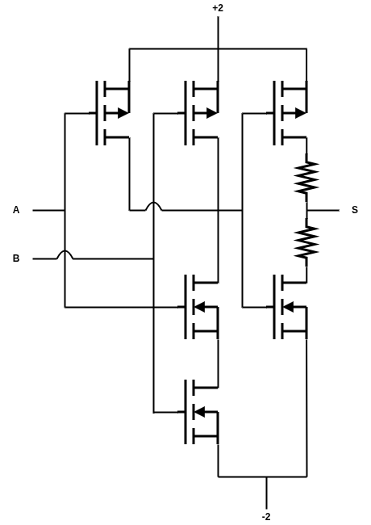
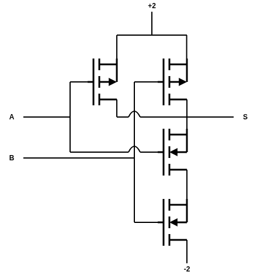
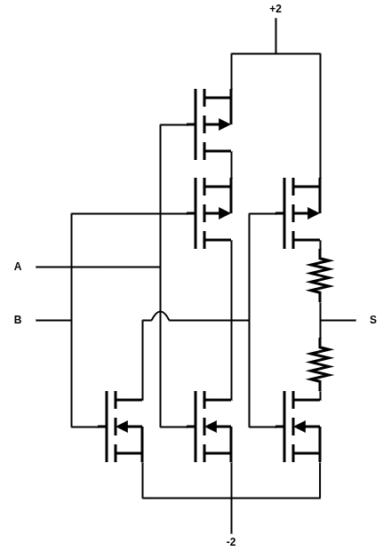
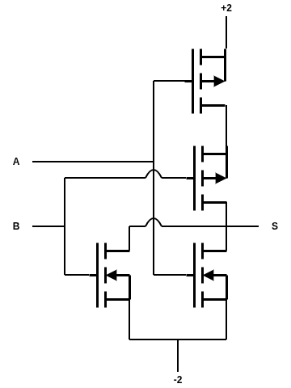
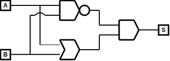
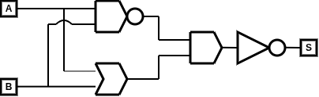

# Ternarium
## Resumo

Este trabalho apresenta o projeto e a implementação do Ternarium, um datapath (caminho de dados) fundamentado em lógica ternária, explorando uma alternativa à arquitetura binária convencional. Enquanto a computação tradicional se limita a estados booleanos, a utilização de trits (unidades ternárias) permite uma maior densidade de informação e potencial redução na complexidade de interconexões. A pesquisa descreve a arquitetura da Unidade Lógica e Aritmética (ULA) ternária, integrando portas lógicas específicas como PNOT, NNOT e funções de consenso (AND/OR ternários), além da estruturação do fluxo de dados e registradores. Os resultados obtidos via simulação [mencione o software, como LTspice ou MATLAB] demonstram a viabilidade da execução de instruções em base 3, evidenciando os desafios e as vantagens da lógica multivalorada na eficiência de processamento. O projeto contribui para o campo de arquitetura de computadores ao propor uma infraestrutura funcional para sistemas não-binários, servindo de base para futuras implementações de processadores ternários completos.

## Base 3
## Base de 27
## Complemento de 3
## Componentes eletrônicos
### n-MOS
### p-MOS
## Portas Lógicas
### PNOT

  

### SNOT

  

### NNOT

  

### AND

  

### NAND

  

### OR

  

### NOR

  

### XOR

  

### XNOR

  

## Circuitos 
### Decodificador
### Somador
### Subtrator
### Multiplicador
### Divisor
### Comparador
### Multiplexador
### Demultiplexador
### Flip-flop
### Registrador
## Datapath
### Memória de Instruções
### Banco de Registradores
### ULA
### Controle
### Memória
## Referências
